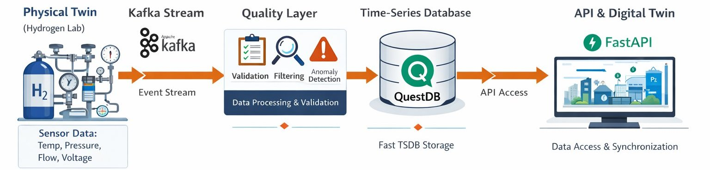

# Simulation Hydrogen Kafka Pipeline

A containerized, real-time data pipeline that simulates hydrogen plant telemetry, streams it through Kafka, validates it, stores it in QuestDB, and exposes authenticated sync APIs via FastAPI — with live metrics in Prometheus and Grafana.

<p align="center">
  
</p>

## What this project does

This repository models a **Physical Twin → Digital Twin** workflow for a hydrogen production and storage plant:

1. A physics-based **simulator** generates realistic alkaline electrolyser telemetry (H2 flow, pressures, temperatures) based on Pietra et al., *Energies* 2021, 14, 5347.
2. A **Kafka producer** wraps each tick with a device JWT and publishes to the raw topic.
3. A **Kafka consumer** auth-checks and quality-validates each record, writing clean data to `raw_h2_data` and imputed data to `validated_h2_data`; rejected records go to a dead-letter table.
4. A **FastAPI app** exposes JWT auth endpoints and researcher/admin sync APIs.
5. **Prometheus** scrapes metrics from both the consumer and the API; **Grafana** visualises live telemetry and pipeline health.

## Tech stack

| Component | Role |
|---|---|
| Apache Kafka + Zookeeper | Streaming backbone |
| QuestDB | Time-series storage (HTTP REST + PostgreSQL wire) |
| FastAPI | Auth, sync, and metrics API |
| Prometheus | Metrics scraping |
| Grafana | Live dashboards |
| Docker Compose | Full-stack orchestration |
| JWT + bcrypt | Device / researcher / admin access control |

## Repository layout

```text
.
├── docker-compose.yml
├── docker/
│   ├── Dockerfile.producer
│   └── Dockerfile.consumer
├── TSDB.yml                         # Table schema — single source of truth
│
├── config/
│   ├── settings.py                  # Pydantic Settings — all env vars
│   ├── logging.py                   # Central structlog configuration
│   ├── prometheus.yml               # Scrape config
│   └── grafana/
│       ├── provisioning/
│       │   ├── datasources/         # Prometheus + QuestDB (PostgreSQL)
│       │   └── dashboards/          # Dashboard provider config
│       └── dashboards/
│           ├── h2_pipeline.json        # Pipeline health (ingest rate, yield, sync lag)
│           ├── sensor_data.json        # Per-sensor time series with table selector
│           └── quality_dimensions.json # Per-message quality scores (WQS, LWQS, QSD, …)
│
├── domain/
│   ├── telemetry.py                 # TelemetryRecord, AuthBlock models
│   ├── quality.py                   # Pure validation / quality functions
│   └── auth.py                      # Pure JWT functions
├── infrastructure/
│   ├── kafka/{producer,consumer}.py
│   ├── questdb/{client,schema}.py
│   ├── ssh/transfer.py
│   ├── metrics.py                   # Prometheus counters and gauges
│   └── registry/
│       ├── repository.py
│       └── data/
│           ├── device_registry.json
│           └── researcher_registry.json
├── services/
│   ├── auth_service.py
│   ├── ingestion_service.py         # consume → validate → store (+ dead-letter)
│   └── sync_service.py
├── api/
│   ├── main.py
│   ├── dependencies.py
│   └── routers/{auth,researcher_sync,admin_sync}.py
├── workers/
│   └── auto_sync_worker.py
├── simulator/
│   ├── hydrogen_plant.py            # Alkaline electrolyser plant model (Pietra 2021)
│   └── physics_model.py             # Shim — initial_state() / generate_physical_state()
├── cmd/
│   ├── producer.py
│   └── consumer.py
├── scripts/
│   └── hash_credentials.py
└── tests/unit/
```

## Prerequisites

- Docker + Docker Compose
- Python 3.9+ (only for local runs or tests)

## Quick start

### 1. Clone

```bash
git clone https://github.com/Nkana-valentin/Simulation-Hydrogen-Kafka-Pipeline.git
cd Simulation-Hydrogen-Kafka-Pipeline
```

### 2. Create `.env`

```env
# API
FASTAPI_PORT=8080

# Kafka
KAFKA_BROKER=broker:9092
KAFKA_TOPIC_RAW=raw_h2_data

# QuestDB
QUESTDB_HOST=questdb
QUESTDB_PORT=9000
QUESTDB_USER=admin
QUESTDB_PASSWORD=quest
VALIDATED_TABLE=validated_h2_data   # QuestDB table name, not a Kafka topic

# JWT — use a strong random value in any non-local deployment
JWT_SECRET=change-me-in-production-must-be-32-chars-min

# Device credentials (producer authenticates with these)
DEVICE_SECRET=sim-device-secret-01
AUTH_SERVICE_URL=http://fastapi_app:8000
# Sync worker
BATCH_SIZE=50
SYNC_INTERVAL=30s
LOCAL_SYNC_DIR=./synced_data
REMOTE_SYNC_ENABLED=false

# SSH (required fields even when remote sync is disabled)
SSH_HOST=localhost
SSH_USER=user
SSH_REMOTE_PATH=/tmp
SSH_KEY_PATH=/app/.ssh/id_rsa
```

### 3. Start the stack

```bash
docker compose up -d --build
```

### 4. Service URLs

| Service | URL |
|---|---|
| FastAPI docs | `http://localhost:${FASTAPI_PORT}/docs` |
| QuestDB web UI | `http://localhost:9000` |
| Prometheus | `http://localhost:9090` |
| Grafana | `http://localhost:3000` (admin / admin) |

### 5. Follow logs

```bash
docker logs -f kafka_producer   # telemetry simulator + producer
docker logs -f kafka_consumer   # ingestion, quality checks, dead-letter
docker logs -f fastapi_app      # API + background sync worker
```

## Data flow

```
HydrogenPlantSimulator (simulator/hydrogen_plant.py)
  └─▶ KafkaProducerClient  [publishes JSON + device JWT]
        └─▶ Kafka topic  raw_h2_data
              └─▶ IngestionService
                    ├─ JWT auth check
                    │     └─ fail → raw_h2_data_dead_letter
                    ├─ INSERT raw record  →  raw_h2_data
                    │     (NaN / Inf stored as NULL)
                    ├─ dq.evaluate_dimensions()  →  raw_h2_data_quality
                    │     (accuracy, completeness, timeliness, WQS, LWQS, QSD)
                    ├─ dq.clean_record()  (impute NaN with last-known-good)
                    ├─ dq.validate_record()
                    │     ├─ pass  →  validated_h2_data
                    │     └─ fail  →  raw_h2_data_dead_letter
                    └─ Prometheus metrics updated
```

`raw_h2_data` preserves every record exactly as received (bad values become NULL). `validated_h2_data` contains only records that pass all quality checks, with injected NaN / Inf replaced by the last valid reading.

### Example Kafka message

```json
{
  "timestamp":  "2026-04-25T09:48:01.123456Z",
  "H2_001PT":  -4.002,
  "H2_002PT":   4.491,
  "H2_003PT":   4.441,
  "H2_005PT":  13.660,
  "H2_001FT":   2.527,
  "CA_001FC":   0.202,
  "H2_001TT":  26.977,
  "H2_002TT":  16.483,
  "H2_003TT":  18.521,
  "H2_005TT":  25.491,
  "FC_STACK_V": 0.001,
  "FC_STACK_i": 0.003,
  "FC_STATE":  100.0,
  "auth": {
    "token":     "<device JWT>",
    "device_id": "simulation_device_01"
  }
}
```

`H2_001PT` reads ≈ −4 bar g (upstream electrolyser sensor range artefact). `H2_005PT` rises from 10 to 200 bar g over ~5 hours as the storage vessel fills. `H2_001FT` dips to ~15% of nominal every 3 minutes during 8-second purge cycles. FC columns are held at standby since this plant produces H2 rather than consuming it.

## Physics simulator

`simulator/hydrogen_plant.py` implements four coupled sub-models calibrated to Pietra et al. 2021:

| Sub-model | Key behaviour |
|---|---|
| `ElectrolyserModel` | 5-min warmup ramp; purge dips every 180 s (8 s, flow → 15%); SEC 93 kWh/kg @ 4.6 bar g |
| `CompressorModel` | Storage pressure 10 → 200 bar g in ~5 h; drive-air scales 20 → 55 Nm³/h; 45 s air-compressor load/unload cycle |
| `HydrogenBuffer` | 50 L ideal-gas buffer between EL and booster; mass balance updated every tick |
| `TemperatureModel` | Slow random walk on all TT channels; Joule-Thomson cooling reproduced on H2 lines |

`simulator/physics_model.py` is a thin shim that keeps the existing `initial_state()` / `generate_physical_state()` API for backward compatibility.

## Monitoring

### Prometheus metrics

| Metric | Type | Labels | Source |
|---|---|---|---|
| `h2_ingestion_messages_total` | Counter | `result` (received / valid / invalid / auth_failed) | consumer |
| `h2_ingestion_quality_yield_ratio` | Gauge | — | consumer |
| `h2_sync_batches_total` | Counter | `status` | API |
| `h2_sync_records_synced_total` | Counter | — | API |
| `h2_sync_lag_seconds` | Gauge | — | API |

Metrics endpoints:
- Consumer: `http://localhost:8001/` (Prometheus HTTP server)
- FastAPI: `http://localhost:${FASTAPI_PORT}/metrics`

### Grafana dashboards

Three dashboards are provisioned automatically on startup:

- **H2 Pipeline — Live Telemetry** (`h2-pipeline`): ingest rate (msg/s), quality yield gauge (green ≥ 95%), sync lag, cumulative message and sync counters. Datasource: Prometheus.
- **H2 Sensor Data** (`h2-sensors`): per-sensor time series with sensor and table dropdowns. Use `validated_h2_data` for continuous signals; `raw_h2_data` to inspect raw quality. Datasource: QuestDB.
- **H2 Data Quality Dimensions** (`h2-quality`): per-message WQS, LWQS, QSD, accuracy, completeness, timeliness, temporal completeness. Thresholds: green ≥ 0.95, yellow ≥ 0.80, red below. Datasource: QuestDB (`raw_h2_data_quality` table).

## API overview

### Authentication

| Endpoint | Method | Description |
|---|---|---|
| `/device/login` | POST | Issue device JWT (`permissions: ["ingest_data"]`) |
| `/researcher/login` | POST | Issue researcher JWT (`roles`, `data_access`) |
| `/verify` | POST | Validate any token |
| `/health` | GET | Auth service health |

### Researcher sync

| Endpoint | Method | Description |
|---|---|---|
| `/sync/trigger` | POST | Sync one paginated batch |
| `/sync/status` | GET | Sync state and available data |
| `/sync/complete` | POST | Sync all remaining records |

### Auto-sync to Hydor (admin)

| Endpoint | Method | Description |
|---|---|---|
| `/status` | GET | Worker state + pending record count |
| `/trigger` | POST | Trigger one sync batch manually |
| `/remote-sync/test-ssh` | POST | Test SSH connectivity |
| `/summary` | GET | Synced output file summary |

## Automatic sync

The background worker (`workers/auto_sync_worker.py`) starts with the FastAPI app lifespan. It polls QuestDB every `SYNC_INTERVAL` seconds and writes a local batch whenever `BATCH_SIZE` or more new records are found. Set `REMOTE_SYNC_ENABLED=true` to also push batches over SSH to the ORFEO-Hydor platform.

| Variable | Default | Description |
|---|---|---|
| `SYNC_INTERVAL` | `30` | Poll interval (accepts `30`, `30s`, `2m`) |
| `BATCH_SIZE` | `50` | Minimum new records per batch |
| `LOCAL_SYNC_DIR` | `./synced_data` | Local output directory |
| `REMOTE_SYNC_ENABLED` | `false` | Enable SSH push |
| `SSH_HOST` | — | Remote host |
| `SSH_USER` | — | SSH username |
| `SSH_KEY_PATH` | — | Private key path inside container |
| `SSH_REMOTE_PATH` | `/tmp` | Destination directory on remote |

## Testing

Unit tests require no external services:

```bash
JWT_SECRET=any-dev-secret python3 -m pytest tests/unit/ -v
```

## Local run (without Docker)

```bash
python3 -m venv .venv && source .venv/bin/activate
pip install -r requirements.txt

# In separate terminals (Kafka + QuestDB must already be running):
uvicorn api.main:app --reload
python3 -m cmd.producer
python3 -m cmd.consumer
```

## Troubleshooting

| Symptom | Likely cause | Fix |
|---|---|---|
| FastAPI exits at startup | `JWT_SECRET` not set | Add `JWT_SECRET=...` to `.env` |
| Producer exits at startup | `DEVICE_SECRET` not set | Add `DEVICE_SECRET=...` to `.env` |
| Producer cannot reach API | Auth service not ready | Producer retries 10× with 5 s back-off |
| No data in QuestDB | Consumer auth failure | Check `docker logs kafka_consumer` for `auth_failed` |
| Grafana panels show no data | Wrong table selected | Switch dropdown to `validated_h2_data` |
| Grafana datasource error | QuestDB not reachable | Verify `custom_questdb:8812` is up |

## License

This project is licensed under the terms of the [LICENSE](LICENSE) file.
